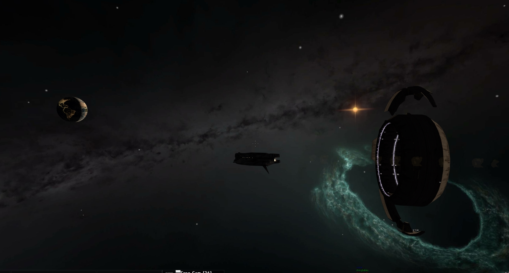
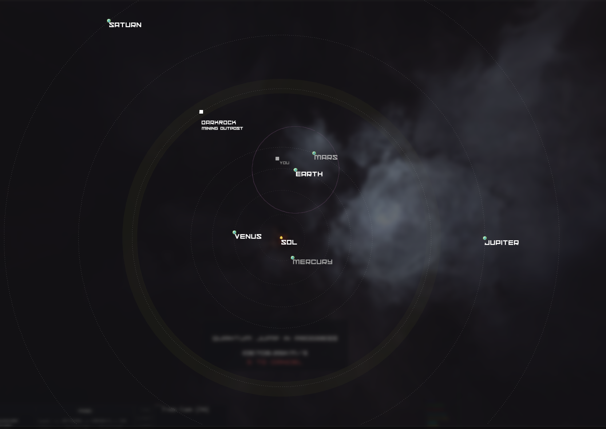
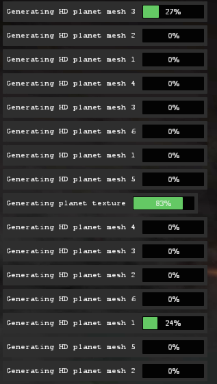

[Back](https://dhog10.github.io/portfolio/)

## Lua
I have scripted Lua for many years, Lua was my second language which I learned after Java. My experience scripting in Lua relates to the game Garry'sMod, creating various addons and gamemodes for the my game servers.

### Expanse
Expanse is my Garrysmod gamemode, set in space it sets to push the limits of the game beyond the Source engine's intended capabilities. I wanted to create a gamemode where the player could fly a space ship around in space, explore and travel across vast distances in space.
This project is very much unfinished, and has been a side project of mine for almost a year.

<video width="480" height="320" controls="controls">
  <source src="images/expanse/flight.mp4" type="video/mp4">
</video>
The source engine by default will only support coordinates from -16000 to 16000 (the space station in the video above is pretty much 16000 units wide), I overcame this obstacle by implementing my own coordinate system, which would use a sector combined with local coordinates to evaluate your global coordinates. Using two vectors to represent your global coordinates allowed me to expand the maximum potential location of objects to extreme limits, even beyond floating point imprecision. To have objects render in the correct location, I calculate the relative global coordinates between your player and the target. Essentially, rather than you moving through the universe, everything in the universe moves around you. (This also works in multiplayer)
<video width="480" height="320" controls="controls">
  <source src="images/expanse/tactical_map.mp4" type="video/mp4">
</video>
The tactical map is inspired from Eve Online's tactical map view, it allows the player a strategic overview of their surroundings, and can be used to launch missiles and countermeasures.

Stellar bodies (planets & stars) are rendered seperately to other object, a calculation is done to calculate an offset and scale in which the body should be rendered relative to the camera. This position is close to the camera, however rendered in such a way to appear as if it is really present in space, this also functions with Z depth.
<video width="480" height="320" controls="controls">
  <source src="images/expanse/warp.mp4" type="video/mp4">
</video>
As I approach the planet in warp, the planet appears to physically become closer, this illusion is key for rendering things which are too far away to physically simulate, such as stars and distant planets.

The asteroid belt (yellow ring) represents an area of space which should be filled with asteroids. Millions of asteroids would be present in an area of this size surrounding the entire star. To allow me to populate this space with asteroids I use a procedural approach.
<video width="480" height="320" controls="controls">
  <source src="images/expanse/warp.mp4" type="video/mp4">
</video>
Once the player enters a region, I procedurally scatter the contents of that region in the area near the player. In this case that region is filled with asteroids, the scattering is consistant for each unique location as I use a seed based on the sector coordinates to populate the area.

To populate the universe with diverse content, I created procedural planets. These planets are generated using 3D simplex noise, terrain offset and planet textures are generated procedurally at runtime, and applied to a generated mesh. Each planet type can be configured by the administrator, the result is diverse and fairly realistic looking procedural planets!

The Lua instance is single threaded, meaning I must use coroutines to generate the planet mesh and textures asynchronously to not freeze the game.
[A forum post on my forum going to more detail on procedural planets](https://www.civilgamers.com/forum/m/18343296/viewthread/32360685-evolution-planets/post/136571934#p136571934)
